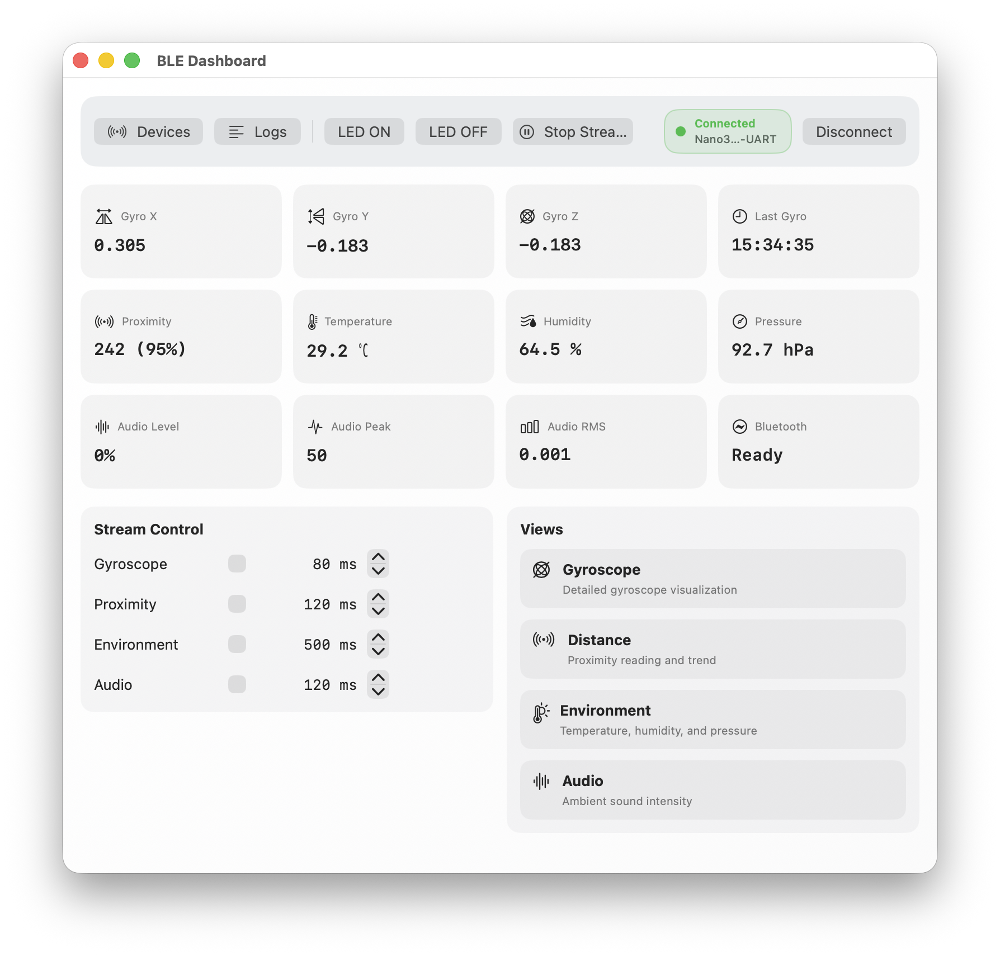
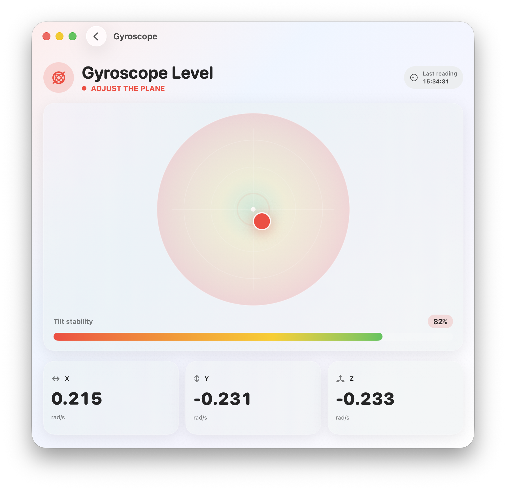
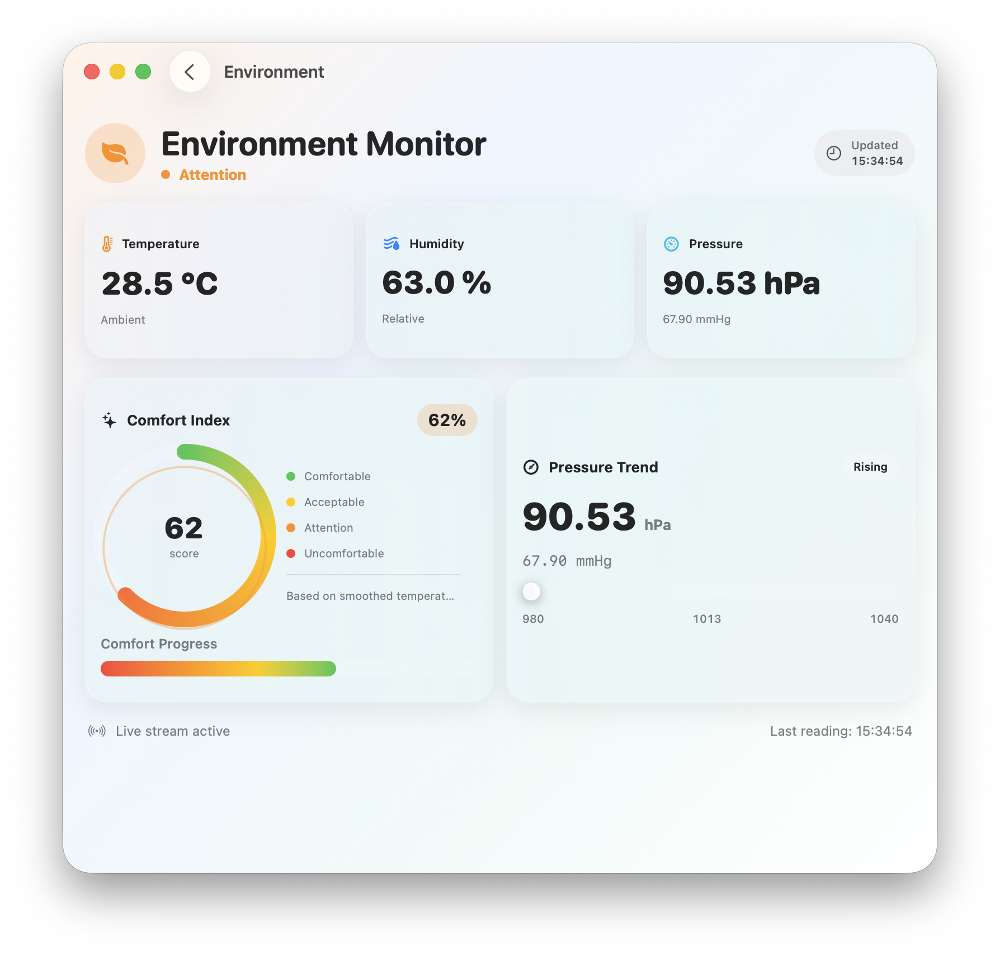
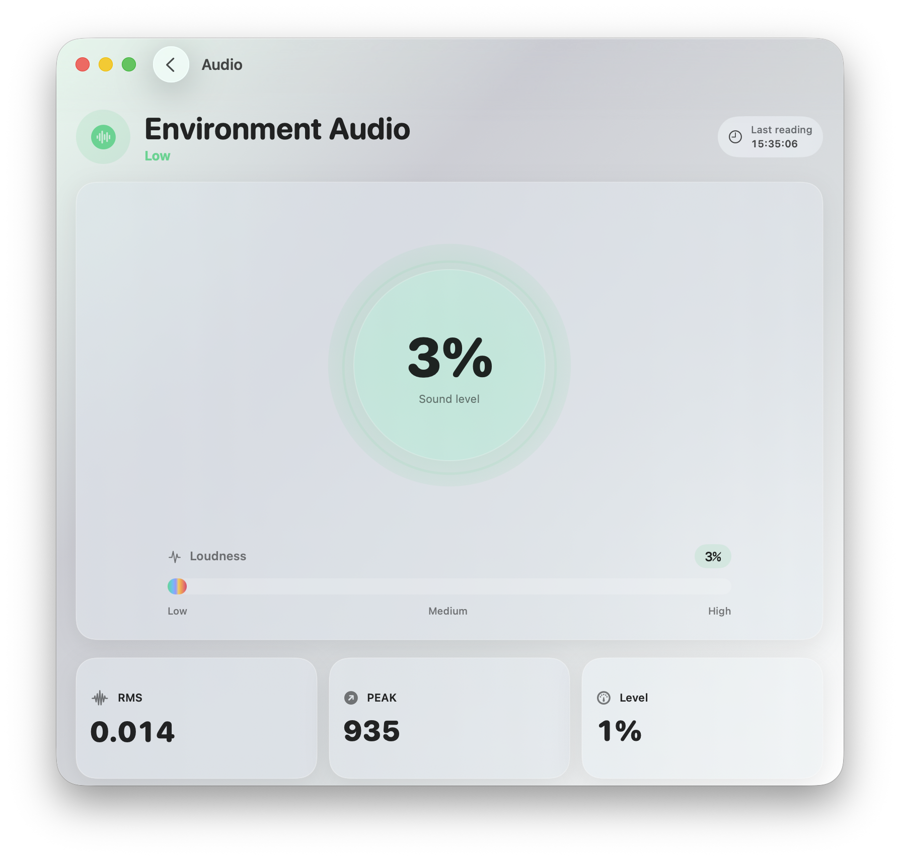

# BLE_Mac — Arduino Nano 33 BLE Sense Rev2 Demo (macOS)

A macOS SwiftUI app that connects to **Arduino Nano 33 BLE Sense Rev2** over BLE (Nordic UART Service style), sends text commands, and visualizes live sensor data:

- Gyroscope
- Proximity
- Environment (temperature, humidity, pressure)
- Audio level (PDM mic)

This project is designed as a practical desktop demo for BLE + sensors, with dedicated windows for devices and logs.

---

## Screenshots

<table align="center">
  <tr>
    <td align="center">
      <br/>
      <sub><b>Dashboard</b></sub>
    </td>
    <td align="center">
      <br/>
      <sub><b>Giroscope</b></sub>
    </td>
  </tr>
  <tr>
    <td align="center">
      <br/>
      <sub><b>Temperature</b></sub>
    </td>
    <td align="center">
      <br/>
      <sub><b>Audio</b></sub>
    </td>
  </tr>
</table>

---

## Architecture

### macOS App
- **Apple Swift version:** Swift 6.2.3
- **Package tools-version:** 5.10.0
- **UI:** SwiftUI
- **BLE:** CoreBluetooth
- **Build system:** Swift Package Manager

Main components:
- `BluetoothWorker.swift`  
  BLE central manager, scan/connect, command TX, notify RX, JSON parsing, stream timers.
- `DashboardViewModel.swift`  
  Aggregates app state for dashboard and tools windows.
- `DashboardView.swift`  
  Main control panel and navigation hub.
- `DevicesWindowView.swift`  
  Device discovery and connect window.
- `LogsWindowView.swift` (if present in your project)  
  Real-time log viewer.
- Sensor-specific screens:
  - `GiroscopeView.swift`
  - `DistanceView.swift`
  - `EnvironmentView.swift`
  - `EnvironmentAudioView.swift`

### Arduino Sketch
The sketch exposes a BLE UART-like service and responds to command strings:
- `LED ON`, `LED OFF`
- `GIROSCOPE`
- `PROXIMITY`
- `TEMPERATURE`, `HUMIDITY`, `PRESSURE`
- `ENV`
- `AUDIO`

Responses are JSON lines (`\n` terminated), parsed by the macOS app.

---

## BLE Service/Characteristics

Using NUS-compatible UUIDs:

- **Service**: `6E400001-B5A3-F393-E0A9-E50E24DCCA9E`
- **RX (write)**: `6E400002-B5A3-F393-E0A9-E50E24DCCA9E`
- **TX (notify)**: `6E400003-B5A3-F393-E0A9-E50E24DCCA9E`

---

## Requirements

### macOS
- macOS 14+ (package target)
- Swift 6.2.3
- Swift toolchain compatible with Swift 6.2.3

### Board
- Arduino Nano 33 BLE Sense Rev2
- Arduino IDE / Arduino CLI with libraries:
  - `ArduinoBLE`
  - `Arduino_BMI270_BMM150`
  - `Arduino_APDS9960`
  - `Arduino_HS300x`
  - `Arduino_LPS22HB`
  - `PDM`

---

## Build and Run (App)

From project root:

```bash
swift run BLEControlApp
```

Or release build:

```bash
swift build -c release
./.build/release/BLEControlApp
```

---

## Package.swift (reference)

```swift
// swift-tools-version: 5.10
import PackageDescription

let package = Package(
    name: "BLE_Mac",
    platforms: [
        .macOS(.v14)
    ],
    products: [
        .executable(name: "BLEControlApp", targets: ["BLEControlApp"])
    ],
    targets: [
        .executableTarget(
            name: "BLEControlApp",
            path: "Sources/BLEControlApp"
        )
    ]
)
```

---

## Bundle as .app (optional)

If you use your `pack.sh` script:

```bash
./pack.sh
open "dist/BLEControlApp.app"
```

It builds release, prepares icon resources, creates the `.app` bundle, and performs ad-hoc signing.

---

## Arduino Sketch Notes

The included sketch:
- Starts BLE UART-like service
- Reads sensors on demand
- Computes audio RMS/peak from PDM callback
- Sends JSON lines back to macOS app

Make sure board is flashed and advertising before connecting from the app.

---

## Typical Workflow

1. Power and flash the Nano 33 BLE Sense Rev2.
2. Launch `BLEControlApp`.
3. Open **Tools → Devices** and click **Search**.
4. Connect to `Nano33BLE-UART` (or your configured local name).
5. Use dashboard stream toggles and open sensor screens as needed.
6. Open **Tools → Logs** for raw TX/RX diagnostics.

---

## Troubleshooting

- **No devices found**
  - Confirm board is powered and advertising.
  - Confirm UUIDs in app and sketch match.
  - Ensure Bluetooth permission is granted on macOS.

- **Connected but no data**
  - Check that stream is enabled in dashboard.
  - Verify notify is enabled for TX characteristic.
  - Inspect logs window for parse/command errors.

- **High latency**
  - Increase stream interval in dashboard controls.
  - Avoid enabling all streams at very low intervals simultaneously.

---

## Project Layout (suggested)

```text
BLE_Mac/
├─ Package.swift
├─ README.md
├─ images/
│  ├─ dashboard.png
│  ├─ giroscope.png
│  ├─ temperature.png
│  └─ audio.png
├─ Sources/
│  └─ BLEControlApp/
│     ├─ App.swift
│     ├─ BluetoothWorker.swift
│     ├─ DashboardView.swift
│     ├─ DashboardViewModel.swift
│     ├─ DevicesWindowView.swift
│     ├─ LogsWindowView.swift
│     ├─ GiroscopeView.swift
│     ├─ DistanceView.swift
│     ├─ EnvironmentView.swift
│     └─ EnvironmentAudioView.swift
└─ sketch/
   └─ sketch.ino
```

---

## License

Use the license of your choice for this demo repository (MIT recommended for sample/demo apps).
